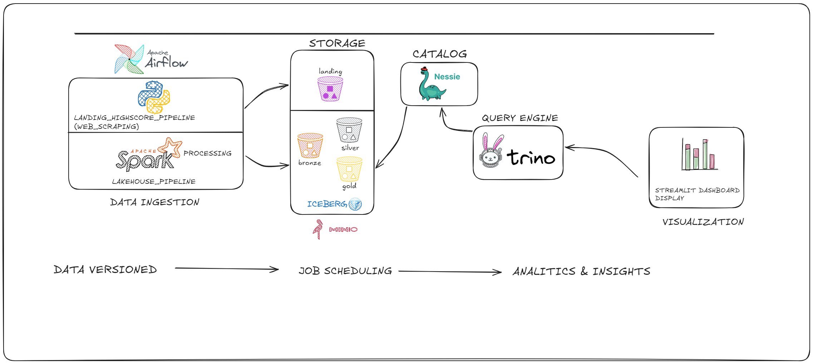

## Visão Geral

Este projeto tem como objetivo construir um Data Lakehouse completo, com orquestração via Apache Airflow, processamento distribuído em PySpark, armazenamento no MinIO (S3) e tabelas Iceberg para gerenciamento de dados versionados e consultas analíticas eficientes.

O pipeline foi projetado para coletar, transformar e disponibilizar dados de forma automatizada, garantindo escalabilidade, governança e reprodutibilidade em todas as etapas.

## Motivação

O Tibia possui rankings públicos que são atualizados constantemente, porém os dados não são disponibilizados de forma estruturada, histórica ou analítica.
Isso dificulta análises como:

- Evolução de jogadores ao longo do tempo
- Comparação entre vocações e tipos de mundo
- Análises históricas de ranking por skill ou experiencia
- Criação de dashboards personalizados e reutilizáveis

Este projeto surge para resolver esse problema por meio de uma arquitetura de dados moderna, confiável e escalável, permitindo análises históricas e versionadas dos rankings do jogo.

## Objetivo

Extrair dados de rankings de jogadores, skills e outras categorias do Tibia.
Estruturar por:
 - Vocação: Knight, Paladin, Druid, Sorcerer, Monk e personagens sem vocação.
 - Tipo de mundo: Open PvP, Optional PvP, Hardcore PvP, Retro Open PvP, Retro Hardcore PvP.
 - Skills: Magic Level, Sword e etc
 - Extra: Achievements, Drome Score, Fishing e etc.
 - Garantir tasks independentes por vocação e categoria no Airflow, permitindo paralelismo e falhas isoladas.
 - Salvar dados de forma estruturada na camada Bronze, permitindo transformações em Silver e Gold.

# Decisão arquitetural
A arquitetura segue o padrão Medallion (Landing → Bronze → Silver → Gold) e integra apenas tecnologias open-source, garantindo portabilidade e independência de fornecedor (vendor lock-in).

Mesmo com ingestões diárias pequenas, a camada Bronze foi construída sobre Apache Iceberg para garantir histórico, versionamento e consistência ao longo do tempo.
O Spark é utilizado não pelo volume atual dos dados, mas por ser o engine mais maduro para escrita transacional em Iceberg, integração com Nessie e evolução futura do pipeline.
Essa abordagem prepara o Lakehouse para crescimento contínuo, auditoria e análises temporais sem necessidade de refatoração estrutural.

## Sumário
- [Visão Geral](https://github.com/lobobranco96/tibia)
- [Source code](https://github.com/lobobranco96/tibia/tree/main/mnt/src)
- [Lakehouse Data](https://github.com/lobobranco96/tibia/tree/main/mnt/minio/lakehouse)
- [Notebooks](https://github.com/lobobranco96/tibia/tree/main/mnt/notebooks)
- [DAGs Airflow](https://github.com/lobobranco96/tibia/tree/main/mnt/airflow/dags)
- [Docker Services](https://github.com/lobobranco96/tibia/tree/main/services)
- [Images](https://github.com/lobobranco96/tibia/tree/main/docs)
- [Dockerfile Builds](https://github.com/lobobranco96/tibia/tree/main/docker)
- [Streamlit App - Visualization Layer](https://github.com/lobobranco96/tibia/tree/main/docker/streamlit)

## Documentação
- Arquitetura: docs/architecture.md  
- Pipeline: docs/pipeline.md  
- Ambiente: docs/environment.md  
- Visualização: docs/visualization.md
- Tabelas Gold: docs/gold_tables.md
- Extraction: docs/extraction.md

## Considerações Finais

Este projeto demonstra a aplicação prática de uma arquitetura Lakehouse moderna,
focada em dados versionados, governança, automação e consumo analítico,
servindo como base para análises históricas e dashboards avançados do Tibia.

