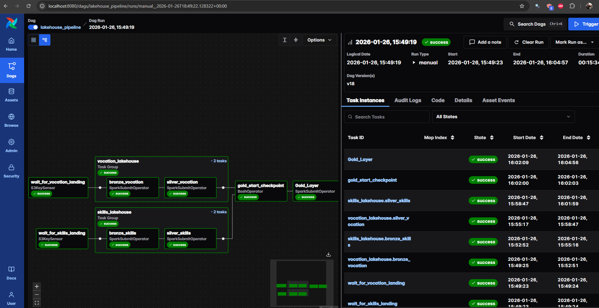
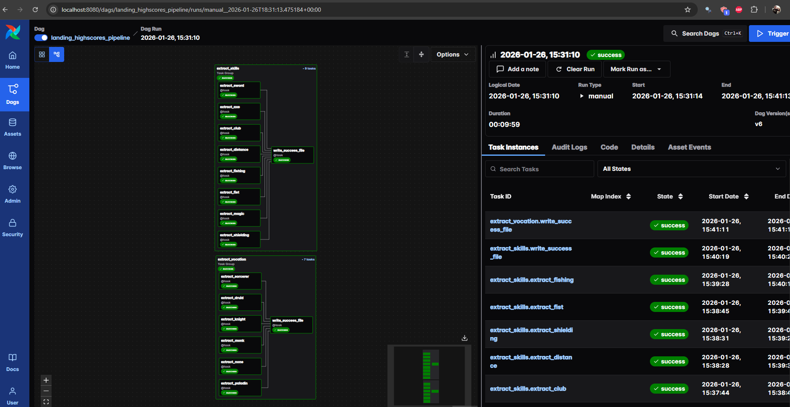

# Pipeline — Tibia Highscore Data Lakehouse

## Visão Geral

O pipeline do projeto Tibia Highscore Data Lakehouse é responsável por orquestrar todo o fluxo de dados desde a extração via web scraping até a disponibilização de tabelas analíticas na camada Gold.

O desenho prioriza:

- Paralelismo
- Incrementalidade
- Isolamento de falhas
- Reprocessamento simples
- Observabilidade

---

## Orquestração com Apache Airflow
O projeto utiliza duas DAGs principais para gerenciar o fluxo completo de dados, garantindo que a extração e o processamento sejam organizados, escaláveis e rastreáveis.

### DAGs Principais

O projeto possui duas DAGs:

1. landing_highscores_pipeline  
2. lakehouse_pipeline  

---

### 1 - DAG de Extração e Ingestão (landing_highscores_pipeline)

```text
┌─────────────────────────────┐
│   Extração / Scraping       │
│ (Airflow - Landing DAG)     │
└──────────────┬──────────────┘
               │
               v
┌─────────────────────────────────────────────┐
│               LANDING (MinIO)               │
│                                             │
│ landing/year=YYYY/month=MM/day=DD/          │
│ ├── vocation/                               │
│ │    ├── knight_*.csv                       │
│ │    ├── druid_*.csv                        │
│ │    └── _SUCCESS                           │
│ │                                           │
│ ├── skills/                                 │
│ │    ├── axe_*.csv                          │
│ │    ├── sword_*.csv                        │
│ │    └── _SUCCESS                           │
│ │                                           │
│ └── extra/                                  │
│      ├── achievements_*.csv                 │
│      ├── boss_*.csv                         │
│      └── _SUCCESS                           │
└──────────────┬──────────────┬───────────────┘
               │              │
               │              │
```
Objetivo: Coletar dados brutos do Tibia, por vocação, skills e categorias extras, e salvar na camada Landing (MinIO/S3) como CSVs particionados por data.
### Características
   - Cada vocação e categoria possui uma task independente, permitindo execução paralela.
   - Falhas em uma task não interrompem as demais, garantindo robustez.
   - Após a extração, os dados ficam prontos para processamento na camada Bronze.
   - Execução paralela
   - Retry automático
            
Camadas envolvidas: Landing → Bronze (pré-processamento inicial, validação e organização dos CSVs).
Exemplo de tasks:
   - extract_vocation (none, knight, paladin, sorcerer, druid, monk)
   - extract_skills (axe, sword, club, distance, magic_level, fist, shielding)


### Output: Arquivos CSV no MinIO organizados por:
```text
s3://landing/year=YYYY/month=MM/day=DD/<categoria>/<arquivo>.csv
```

Exemplo de DataFrame:

| Rank | Name                | Vocation       | World     | Level | Points         | WorldType |
|------|--------------------|----------------|-----------|-------|----------------|-----------|
| 1    | Khaos Poderoso      | Master Sorcerer | Rasteibra | 2515  | 264,738,322,692 | Open PvP  |
| 2    | Goa Luccas          | Master Sorcerer | Inabra    | 2357  | 217,738,829,108 | Open PvP  |
| 3    | Syriz               | Master Sorcerer | Thyria    | 2189  | 174,396,658,081 | Open PvP  |
| 4    | Dany Ellmagnifico   | Master Sorcerer | Inabra    | 2160  | 167,580,849,914 | Open PvP  |
| 5    | Zonatto Bombinhams  | Master Sorcerer | Honbra    | 2132  | 161,212,779,898 | Open PvP  |


### 2 - DAG do Lakehouse (lakehouse_pipeline)

```text
        ┌───────────────────────────┐            ┌───────────────────────────┐       
        │   S3KeySensor (vocation)  │            │   S3KeySensor (skills)    │       
        │ espera: vocation/_SUCCESS │            │ espera: skills/_SUCCESS   │      
        └──────────────┬────────────┘            └──────────────┬────────────┘        
                       │                                        │                                 
                       v                                        v                               
            ┌───────────────────────┐               ┌───────────────────────┐        
            │ Spark Bronze Vocation │               │ Spark Bronze Skills   │       
            └───────────────────────┘               └───────────────────────┘          
```
Objetivo: Processar os dados da camada Bronze e gerar tabelas versionadas nas camadas Silver e Gold, utilizando Spark, Iceberg e Nessie.
Dependência: É acionada automaticamente somente após os dados chegarem na Landing. Com isso o SparkSubmitOperator envia um comando spark-submit para o cluster Spark, iniciando a execução de um job PySpark customizado, responsável por processar os dados a partir dos arquivos da camada Landing e executar as transformações das camadas Bronze e Silver.

### Características
  - Jobs Spark separados por domínio
  - Uso de SparkSubmitOperator
  - Escrita Iceberg + Nessie
 
Detalhes de execução:
  - Cada categoria Bronze possui um job Spark independente:
  - Bronze Vocation > Silver Vocation 
  - Bronze Skills > Silver Skills   


Jobs Spark configurados com todos os jars necessários (AWS, Iceberg, Nessie) para garantir integração completa com MinIO/S3 e tabelas Iceberg.
Camadas envolvidas: Bronze > Silver > Gold (transformações, limpeza, agregações e versionamento).

Output: Tabelas Iceberg versionadas, auditáveis e prontas para consultas via Trino e dashboards.

```text
landing_highscores_pipeline (DAG de extração)
        |
        v
lakehouse_pipeline (DAG de processamento)
        |
        v
Bronze -> Silver -> Gold (Iceberg + Nessie)
```


## Camadas Envolvidas

Landing → Bronze
A camada Bronze é responsável por estruturar os dados brutos provenientes da camada Landing, garantindo padronização, versionamento e auditabilidade.
Nessa etapa:
  - Os arquivos CSV são lidos do MinIO, particionados por data.
  - As tabelas Iceberg são criadas automaticamente no catálogo Nessie.
  - São validadas colunas obrigatórias e aplicadas normalizações leves (tipos, textos e nomes).
  - Os dados recebem metadados de ingestão (batch_id, ingestion_time, ingestion_date).
  - Registros duplicados dentro do mesmo batch são removidos

A escrita é realizada de forma incremental (append), preservando o histórico completo.
Essa camada serve como base confiável e governada para as transformações nas camadas Silver e Gold.

Bronze → Silver
A camada Silver é responsável por aplicar regras de negócio e versionar o histórico dos dados utilizando o padrão SCD Type 2.
Nessa etapa:
 - Os dados mais recentes da camada Bronze são lidos com base no último batch_id.
 - São criadas tabelas Iceberg no catálogo Nessie, caso não existam.
 - São geradas colunas de controle temporal (start_date, end_date, is_current).
 - Alterações nos registros são identificadas por meio de hash_diff.

É executado MERGE INTO para:
 - Encerrar versões antigas quando há mudanças.
 - Inserir novas versões mantendo o histórico.
 - Apenas um registro por chave de negócio permanece como atual (is_current = true).

A camada Silver garante rastreabilidade, histórico completo e consistência dos dados, servindo como base confiável para análises e agregações na camada Gold.

Silver → Gold
A camada Gold é a camada analítica final do Lakehouse, responsável por consolidar dados agregados e métricas prontas para consumo em dashboards e análises avançadas. Ela utiliza tabelas Iceberg versionadas, garantindo histórico, rastreabilidade e consultas eficientes.
Nessa etapa são criadas tabelas analíticas como rankings globais, resumos por mundo e vocação e tabelas de progressão histórica.


### Estratégia de Incrementalidade

```text
Camada	| Estratégia
Bronze	| Append
Silver	| MERGE
Gold	| INSERT
```

## Backfill

  - Qualquer tabela Gold pode ser reconstruída a partir da Silver.

## Tratamento de Falhas

  - Falhas não bloqueiam outras categorias
  - Retry configurado
  - Logs centralizados

## SLA

  - Pipeline diário.
  - Benefícios
  - Alta confiabilidade
  - Escalável
  - Reprocessável

## Screenshot


