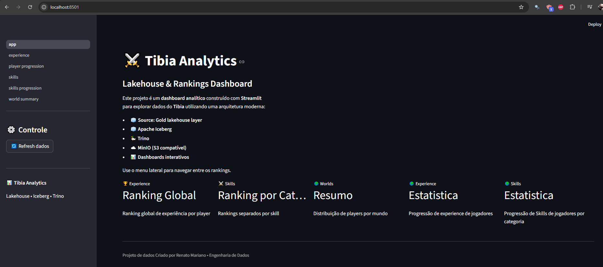
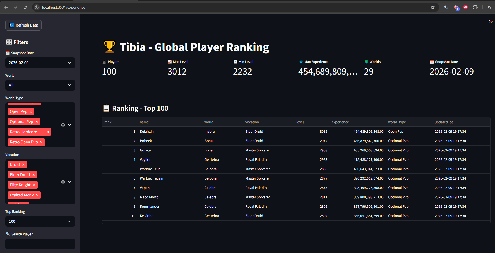
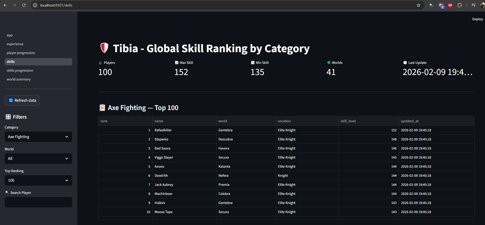
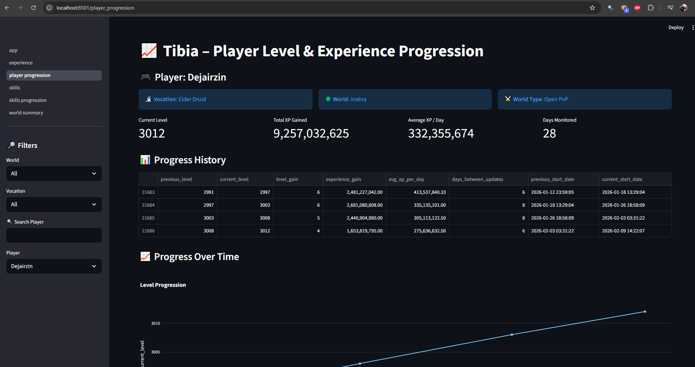
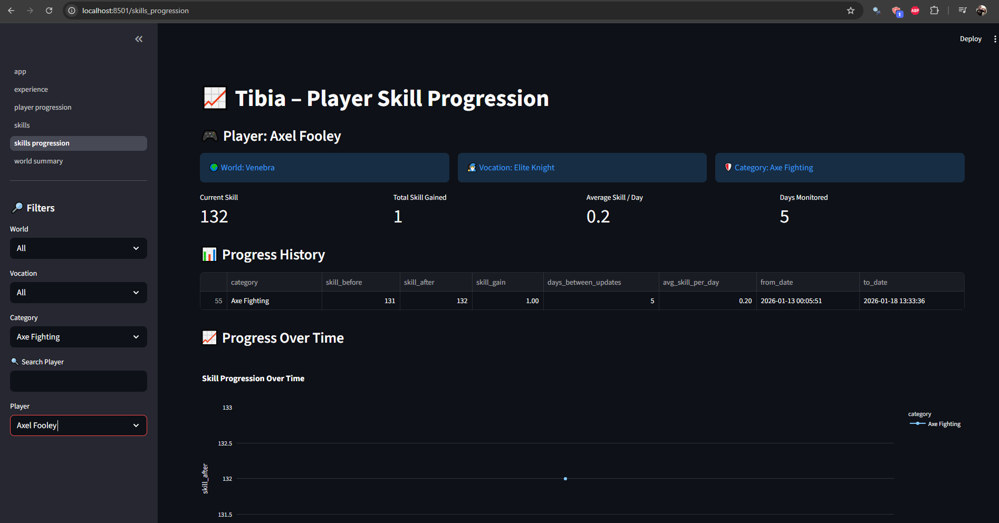
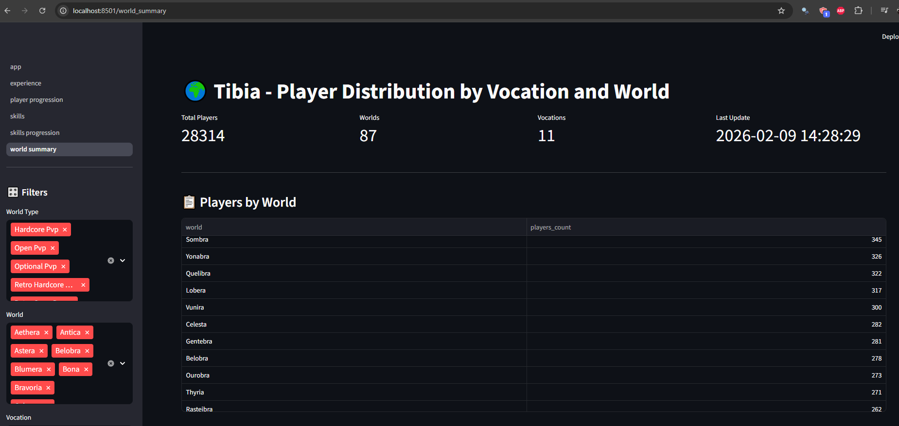

# Visualization Layer — Streamlit Dashboards

Este documento descreve a camada de visualização do projeto Tibia Highscore Data Lakehouse, construída com Streamlit, consumindo dados diretamente das tabelas Iceberg na camada Gold através do Trino.

A camada de visualização fornece dashboards interativos para:
  - Rankings globais de experiência
  - Rankings globais de skills por categoria
  - Evolução histórica de jogadores
  - Evolução histórica de skills
  - Distribuição de jogadores por world e vocação

### Screenshot


--- 

## Arquitetura da Visualização
```text
Iceberg Tables (Gold)
        |
        v
     Trino SQL
        |
        v
  Python Queries (pandas)
        |
        v
    Streamlit App
```
Cada página executa queries SQL via Trino, aplica filtros em memória com Pandas e renderiza tabelas e gráficos interativos.

## Global Player Ranking (Experience)

**Fonte de dados**:
  - nessie.gold.experience_global_rank

**Objetivo**:
  - Exibir ranking global diário de jogadores baseado em experiência e level.

### Funcionalidades

- Seleção de snapshot_date
- Filtro por:
  - World
  - World Type
  - Vocation

- Top N (10, 50, 100, 500, 1000)
- Busca por nome do jogador

- KPIs:
  - Total de jogadores
  - Level máximo e mínimo
  - Maior experiência
  - Quantidade de mundos
  - Data do snapshot

- Lógica de Ranking
- Deduplicação por (snapshot_date, name)
- Ordenação:
  - experience DESC
  - level DESC
  - name ASC
- Ranking recalculado dinamicamente no momento da consulta.

### Screenshot


## Global Skill Ranking

**Fonte de dados**:
  - nessie.gold.skills_global_rank

**Objetivo**:
  - Ranking global diário por categoria de skill.

### Funcionalidades

- Seleção de snapshot_date
- Filtro por:
  - Categoria (skill)
  - World
- Top N
- Busca por jogador
- KPIs:
  - Jogadores
  - Skill máxima e mínima
  - Worlds
  - Última atualização
  - Lógica de Ranking
  - Deduplicação por (snapshot_date, name, skill_name)

Ordenação:
  - skill_level DESC
  - name ASC

### Screenshot


--- 

## Player Experience Progression

**Fonte de dados**:
  - nessie.gold.player_progression

**Objetivo**:
  - Visualizar evolução de level e experiência de um jogador ao longo do tempo.

### Funcionalidades

 -  Filtro por:
    - World
    - Vocation
    - Player
- KPIs:
   - Level atual
   - Total XP ganho
   - Média de XP por dia
   - Dias monitorados
   - Tabela histórica

- Gráficos:
  - Linha → Level ao longo do tempo
  - Barras → XP ganho por período

### Screenshot


--- 

## Player Skill Progression

**Fonte de dados**:
  - nessie.gold.skills_progression

**Objetivo**:
  - Visualizar evolução histórica das skills por jogador e categoria.

### Funcionalidades

- Filtro por:
    - World
    - Vocation
    - Categoria
    - Player
- KPIs:
    - Skill atual
    - Skill total ganha
    - Média por dia
    - Dias monitorados

- Tabela histórica
- Gráfico de linha por categoria

### Screenshot


--- 

## Players by World & Vocation

**Fonte de dados**:
  - nessie.gold.world_summary

**Objetivo**:
  - Visão agregada de distribuição de jogadores.

### Funcionalidades
- Filtro por:
    - World Type
    - World
    - Vocation
- KPIs:
    - Total de jogadores
    - Quantidade de worlds
    - Quantidade de vocações
    - Última atualização

- Tabelas:
  - Players por world
  - Players por vocation
  - Dataset detalhado

### Screenshot


--- 

## Atualização de Dados
  - Botão Refresh Data limpa cache local (st.cache_data.clear())
  - Novos dados ficam disponíveis assim que a camada Gold é atualizada pelo Airflow.

## Boas Práticas Implementadas

  - Cache de dados com st.cache_data
  - Conversão de tipos explícita
  - Filtros aplicados após leitura
  - Queries desacopladas em módulo core/queries.py
  - Nenhuma lógica pesada no Streamlit (apenas consumo)

## Benefícios da Arquitetura

  - Baixa latência
  - Forte desacoplamento entre processamento e visualização
  - Escalável para novos dashboards
  - Compatível com qualquer engine SQL que suporte Iceberg
